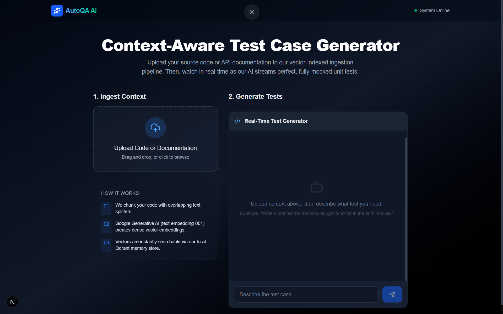
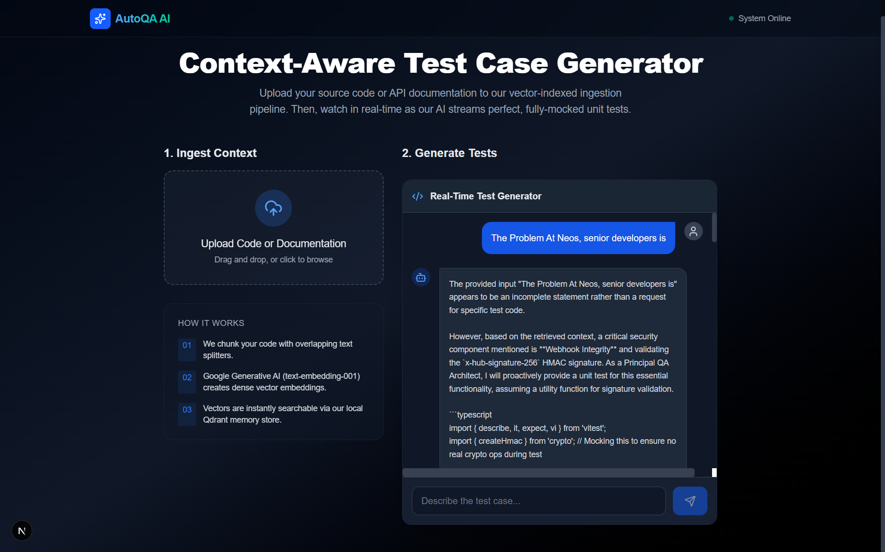

<div align="center">

# 🤖 Context-Aware RAG Test Case Generator

**A high-performance Full-Stack AI application designed to automatically generate syntactically correct unit tests by understanding your project's specific context and business logic.**


</div>

---

## 🏗️ Architecture: The RAG Workflow

The application implements a sophisticated **Retrieval-Augmented Generation (RAG)** pipeline to ensure the AI has access to your private codebase without requiring full fine-tuning.

1.  **Ingestion**: Files (PDF, TS, JS) are parsed and split into semantic chunks.
2.  **Embedding**: Chunks are converted into 3072-dimensional vectors using Google Gemini.
3.  **Similarity Search**: When you ask a question, the system queries the Qdrant Vector DB for the most relevant code contexts.
4.  **Augmented Generation**: The user prompt + retrieved context are piped into Gemini to produce perfectly mocked, context-aware test cases.

## 🔒 Security & Privacy

The modular architecture of this project is built with privacy in mind. While it currently uses Google APIs, the system is designed to be **provider-agnostic**. 
- **Modular Retrieval**: The Qdrant instance can be run locally or in a private VPC.
- **Private Deployment**: The architecture allows for switching to local LLMs (via Ollama or LocalAI) if data privacy is strictly required, ensuring no data ever leaves your internal network.

### 🖥️ User Interface


### 🤖 AI in Action (Context-Aware Generation)


## 🛠️ Deployment Guide

### 1. Prerequisite: Vector Database
Run Qdrant locally using Docker:
```bash
docker run -p 6333:6333 qdrant/qdrant
```

### 2. Environment Setup
Create a `.env.local` file in the root directory:
```env
GOOGLE_GENERATIVE_AI_API_KEY=your_gemini_api_key
QDRANT_URL=http://localhost:6333
```

### 3. Local Development
```bash
# Install dependencies
npm install

# Run the development server
npm run dev
```
Open [http://localhost:3000](http://localhost:3000) to start generating tests.


